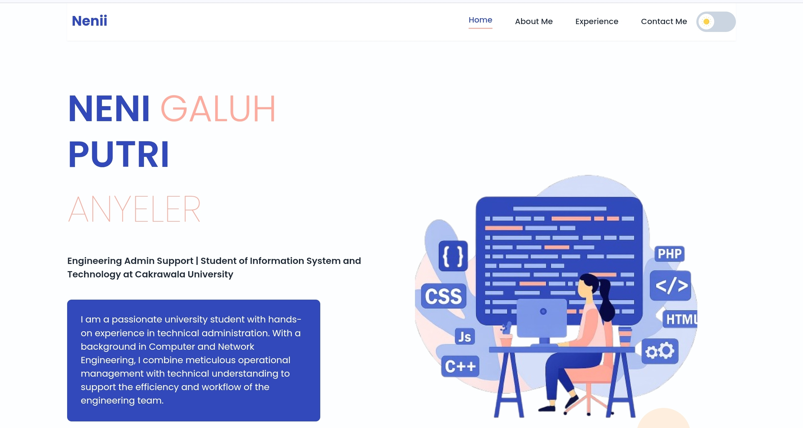

# Profile-website
Website Portofolio Pribadi - Neni Galuh Putri Anyeler
 
Selamat datang di repositori kode untuk website portofolio pribadi saya. Proyek ini dibangun dari awal untuk menampilkan perjalanan, keterampilan, dan pengalaman saya di dunia teknologi dan administrasi.
 
✨ Live Demo
 
Anda dapat melihat hasil akhir dari proyek ini yang sudah di-deploy secara online pada link di bawah ini:
 
➡️ [https://nenianyeler.netlify.app/#home]
 

 
👤 Inforation Dev.
 * Nama: NENI GALUH PUTRI ANYELER
 * NIM: 24120410007
 * Program Studi: Sistem dan Teknologi Informasi (Information System and Technology)
 * Universitas: Universitas Cakrawala
🎯 Tujuan Proyek
Tujuan utama dari pembuatan website portofolio ini adalah untuk menciptakan sebuah identitas digital yang profesional dan komprehensif. Website ini berfungsi sebagai:
 * Kartu Nama Digital: Sebuah platform terpusat untuk menampilkan profil, latar belakang pendidikan, dan pengalaman kerja kepada rekruter, kolega, dan kolaborator potensial.
 * Pameran Keterampilan: Menunjukkan secara visual dan praktis kemampuan dalam pengembangan web, mulai dari desain UI/UX hingga implementasi kode.
 * Pembuktian Konsep: Menjadi bukti nyata dari penerapan teknologi web modern seperti React dan Tailwind CSS dalam sebuah proyek yang fungsional dan estetis.
 * Media Personal Branding: Membangun citra profesional yang kuat di dunia digital.
🛠️ Teknologi & Tools yang Digunakan
Proyek ini dibangun dengan menggunakan serangkaian teknologi dan tools modern yang umum digunakan di industri:
 * React.js: Sebagai library JavaScript utama untuk membangun antarmuka pengguna yang interaktif dan berbasis komponen.
 * Tailwind CSS: Sebuah framework CSS utility-first untuk mempercepat proses styling dan menciptakan desain yang konsisten dan responsif.
 * HTML5 & CSS3: Fondasi dasar untuk struktur dan gaya kustom, termasuk animasi dan variabel.
 * JavaScript (ES6+): Digunakan untuk menangani logika interaktif seperti dark mode dan navigasi.
 * Vite: Sebagai build tool modern yang memberikan pengalaman pengembangan yang sangat cepat.
 * Figma: Digunakan pada tahap awal untuk merancang desain antarmuka (UI) dan pengalaman pengguna (UX).
 * Netlify: Platform untuk melakukan deployment dan hosting website sehingga dapat diakses secara online.
 * GitHub: Sebagai platform untuk manajemen versi kode dan kolaborasi.
🚀 Fitur Unggulan
 * Desain Responsif Penuh: Tampilan website dapat beradaptasi dengan baik di berbagai ukuran layar, mulai dari desktop, tablet, hingga mobile.
 * Mode Terang & Gelap (Dark Mode): Dilengkapi dengan tombol toggle yang memungkinkan pengguna memilih tema tampilan sesuai preferensi. Pilihan tema akan tersimpan di perangkat pengguna.
 * Navigasi "Sticky" & Aktif: Navbar akan selalu menempel di bagian atas saat halaman di-scroll, dan tautan akan menyorot seksi yang sedang aktif.
 * Interaktivitas Halus: Menggunakan transisi CSS untuk memberikan pengalaman pengguna yang lebih mulus dan modern.
 * Formulir Kontak Fungsional: Terintegrasi langsung dengan Netlify Forms untuk menerima pesan dari pengunjung.
Terima kasih telah mengunjungi repositori ini! Jangan ragu untuk memberikan masukan atau terhubung dengan saya melalui kontak yang tersedia di website.
